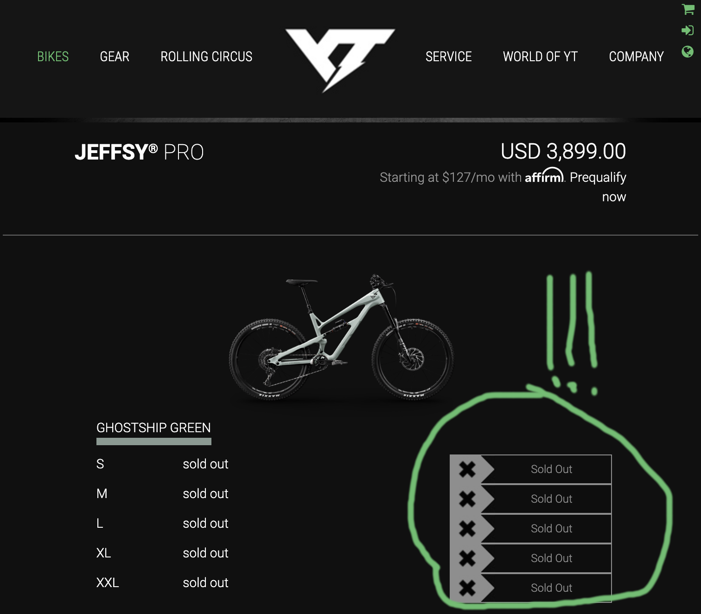
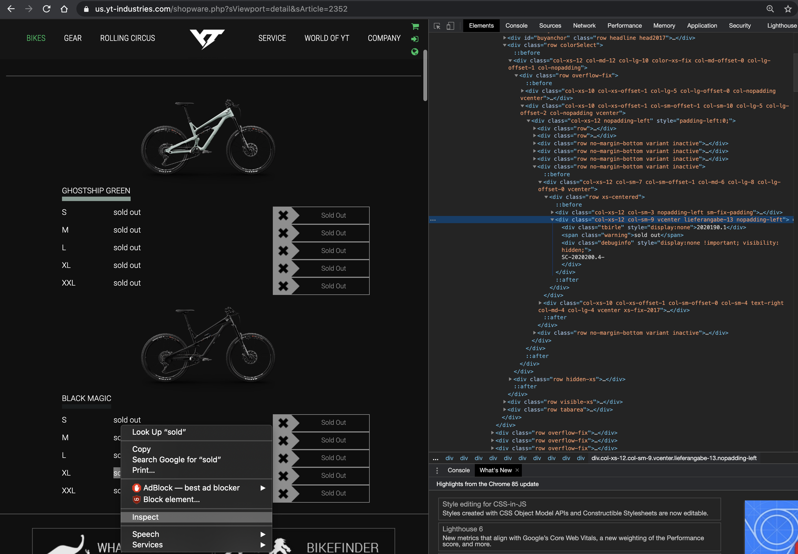

# yt-status

Recent bike inventory shortages have made it difficult to buy new bikes and manually checking YT Bikes stock every couple hours gets old _real quick_.    
I had success in alerting on YT stock using this routine. Helped a friend actually get a bike last week.   
Posting this here; hopefully this little program is useful for someone.    

This little script can be run with a cron job every 5 minutes, for example, to check stock in some YT Jeffsy 27.5 bike models, size XL.   
With a little [work](https://github.com/chrod/yt-status#check-stock-for-yt-bikes-other-than-those-above) you can reuse this for any YT bike you like.    
If your bike is in stock, you'll get an email within a few seconds. Power be to the programmer and good luck! ;)    

 

### Prereqs
- Linux (ubuntu 18.04 used here, both on x86 and aarch64)
- Python3 with the following packages (can be installed with python3-pip) and some library prereqs
    - `sudo apt-get update && sudo apt-get install python3 python3-pip `
    - `pip3 install bs4 smtplib`
- A gmail account, set up with an [App Password](https://support.google.com/mail/answer/185833?hl=en) to receive email messages sent from this script. 
    - Record your app password, something like this: `tdlulzdjskaptlulzjem`.  
    - Follow this App Password [example](https://support.teamgate.com/hc/en-us/articles/115002064229-How-to-create-a-password-to-connect-email-while-using-2-step-verification-in-Gmail-) for a walk-through.  
    - Note that App Passwords are a "less secure" way to send to an account; it's advisable not to enable this on sensitive accounts but rather use an expendable gmail account for this.   

### Installation and setup
- Clone this repo to a local directory
- `cd yt-status`
- Create a file called `.email_creds` and add your destination email address and gmail App password on two separate lines. (see [`.email_creds_example`](https://github.com/chrod/yt-status/blob/master/.email_creds_example))
- Run once with: `python3 ./yt-status.py`
- If the bike(s) are in stock, the script will compose an email message with the subject `YT Bikes in stock` and send to your gmail address. 
- Additional tip: Create an email filter to apply a label to your messages. [example](https://support.google.com/a/users/answer/9308833?hl=en)
- See below to add your own bike types

#### Successful run output (in stock, email if last status check = "sold out"):
```
chrod@odroidc2:~/src/yt-status$ python3 yt-status.py 
email creds set to: email.address@gmail.com ################ (redacted)
Querying bikes from template...
Checking on tues-LG-blackmagic...
  (No Warning)
  bike in stock.
Email Subject: YT Bikes in stock
- tues-LG-blackmagic: https://us.yt-industries.com/detail/index/sArticle/2367/sCategory/261
Checking on tues-XXL-green...
  (No Warning)
  bike in stock.
Email Subject: YT Bikes in stock
- tues-XXL-green: https://us.yt-industries.com/detail/index/sArticle/2367/sCategory/261
From: yt-status@bot.com
To: moskva.mitch@gmail.com
Subject: YT Bikes in stock

YT Bikes in Stock:
- tues-LG-blackmagic: https://us.yt-industries.com/detail/index/sArticle/2367/sCategory/261
- tues-XXL-green: https://us.yt-industries.com/detail/index/sArticle/2367/sCategory/261
```

#### Typical run output (out of stock, no email):   
```
chrod@odroid:~/src/yt-status$ python3 yt-status.py 
email creds set to: email.address@gmail.com ################ (redacted)
Checking on 2020 Jeffsy 27 Pro XL - ghostshipgreen...
  Warning: sold out
Email Subject: YT bikes in stock
Checking on 2020 Jeffsy 27 Pro XL - blackmagic...
  Warning: sold out
Email Subject: YT bikes in stock
Checking on 2019 Jeffsy 27 CF Pro XL - red...
  Warning: sold out
Email Subject: YT bikes in stock
Checking on 2019 Jeffsy 27 CF Pro XL - white...
  Warning: sold out
Email Subject: YT bikes in stock
Checking on 2019 Jeffsy 27 CF Pro-Race XL - silver...
  Warning: sold out
Email Subject: YT bikes in stock
No YT bike stock updates to report.
```

### Running with cron
I implemented this script to run at 5 minute intervals until my friend got his bike.  
Linux / UNIX [crontab](https://man7.org/linux/man-pages/man5/crontab.5.html) is very useful for executing commands on a regular schedule.    
From `crontab -e`:   
```
## Sample crontab
# m h  dom mon dow   command
## YT Bike alerts
*/5 * * * * python3 /home/user/src/yt-status/yt-status.py
```
### Check stock for YT bikes other than those above
YT Bikes websites use unique static html descriptors in their website model stock fields. You can key on these to check stock for any bike type and size.    

In the script's yt_bikes [dict](https://github.com/chrod/yt-status/blob/master/yt-status.py#L109), you need to provide 2 new pieces of information:
- `url`: the full URL path to the bike purchase page of interest
- `div_kwd`: the unique string of html that accompanies the "in stock" / "sold out" status on the page for your Bike Model/Size.  You can find this by right-clicking on the "out of stock" text in your browser and choosing "Inspect".    

  

This will open the "Developer Options" menu where you can extract the html content.     
In this case, the html string we want is the full `div class`: `col-xs-12 col-sm-9 vcenter lieferangabe-13 nopadding-left`.     
Copy that and the URL, and add them to the dict with a convenient unique description of the bike.    

```
    yt_bikes = {"2020 Jeffsy 27 Pro XL - blackmagic":
                  {"url": "https://us.yt-industries.com/detail/index/sArticle/2352/sCategory/511",
                  "div_kwd": "col-xs-12 col-sm-9 vcenter lieferangabe-13 nopadding-left",
                  "status": "out of stock",
                  "last_check": 0.0},
```


### Test Mode
Set the `test_mode` variable to True to suppress emails (email subject is changed). Test mode also adds additional "test" data to the data dict (YT Tues bikes more likely in stock).    
```
    # Test data
    test_dict = {
                "tues-LG-blackmagic":
                  {"url": "https://us.yt-industries.com/detail/index/sArticle/2367/sCategory/261",
                  "div_kwd": "col-xs-12 col-sm-9 vcenter lieferangabe-12 nopadding-left",
                  "status": "out of stock",
                  "last_check": 0.0},
                "tues-XXL-green":
                  {"url": "https://us.yt-industries.com/detail/index/sArticle/2367/sCategory/261",
                  "div_kwd": "col-xs-12 col-sm-9 vcenter lieferangabe-5 nopadding-left",
                  "status": "out of stock",
                  "last_check": 0.0}
               }
```
